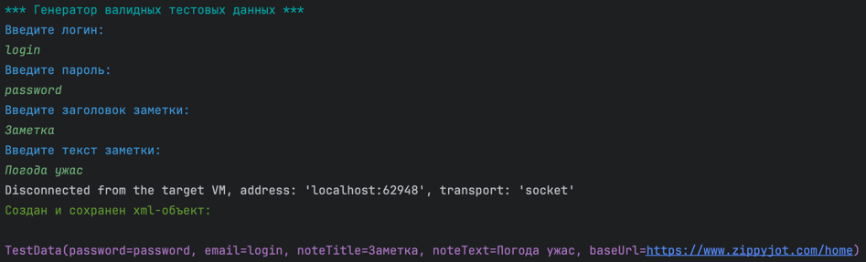
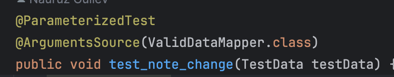

### Как работает

* Есть 2 генератора: один спрашивает пользователя данные, другой генерит рандомные строки. Оба лежат [тут](src/main/java/ru/kpfu/itis/generator/).
Пример работы:

* Сгенеренные объекты записывается в xml-файлики, которые сохраняются в корне проекта под именем valid_data.xml и invalid_data.xml
* В дальнейшем сгенеренные объекты приходят параметрами в тестах. Валидность данных решается мапером, который указывается в аннотации.

### Как запускать

* Сначала лучше запустить генераторы и создать свои объекты.
* Затем можно запускать тесты. Можно начать с [LoginTests](src/test/java/ru/kpfu/itis/test/LoginTests.java) и потом лучше соблюдать такой порядок:

1. CreateTest
2. ChangeTest
3. DeleteTest

В условии ДЗ 10 написано, что тесты должны запускаться по порядку в одном окне браузера, но непонятно, 
это касается всех тестов или тестов в рамках одного класса. В рамках одного класса они именно так и работают, если же запускать все разом, то нет.

### Какие домашки сделаны

#### ДЗ 7
- Настроить VisualStudio
- Создать проект NUnit (JUnit)
- Записать тест рекордером
- Экспортировать тест в среду разработки
- Запустить тест через VisualStudio

#### ДЗ 8

- Отрефакторить код
- Добавить базовый класс для тестов
- Добавить классы для объектов сайта
- Добавить новый тест на добавление какой-либо сущности на сайт

#### ДЗ 9

- Добавить в тестовый набор два теста:
    1. Редактирование элемента
    2. Логаут
- Внедрить в структуру автотестов Application Manager
- Внедрить в структуру автотестов HeplerBase и хелперы
- Организовать структуру файлов проекта

#### ДЗ 10

- Добавить тест на удаление
- Сделать так, чтобы при запуске всех автотестов через кнопку Run All, все тесты запускались друг за другом в одном экземпляре браузера
- После каждого теста добавить Assert'ы, проверяющите конечный результат

#### ДЗ 11

- Создать генератор
- Сгенерировать файл с тестовыми данными (XML, JSON, etc.)
- Научить тест на создание принимать на вход данные из файла

#### ДЗ 12

- Сделать "умную авторизацию"
- Внедрить получение настроечных данных из файла
- Написать тесты для авторизации с валидными и невалидными данными
